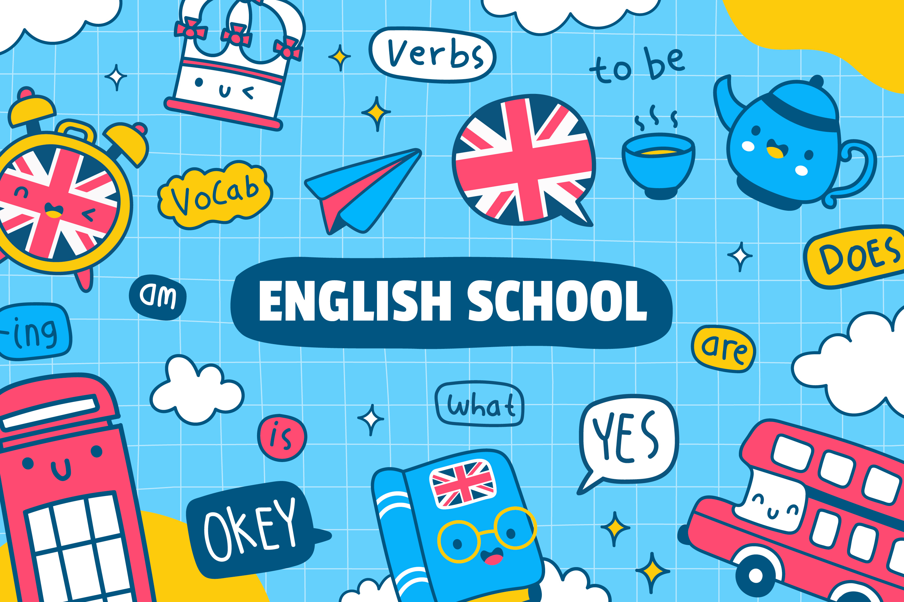

# 💬 English Study Lab

  

> **"언어 학습은 단순한 암기가 아닌, 체계적인 훈련과 구조의 이해입니다."**

토익(TOEIC)과 실용 영어를 위한 체계적인 학습 자료를 연구하고 공유하는 **English Study Lab**입니다. 기초부터 고급까지, 누구나 효율적으로 영어의 구조를 이해하고 어휘를 확장할 수 있도록 돕는 교육 아카이브입니다.

---

### 💡 Our Approach

* **체계적 구조화:** 학습자의 현재 수준에 맞춘 점수대별, 단계별 완벽한 커리큘럼과 로드맵을 제공합니다.
* **실전 지향:** 이론에 머물지 않고, 실제 토익 빈출 패턴과 비즈니스 환경에서 쓰이는 예문으로 학습합니다.
* **오픈소스 학습:** 누구나 자유롭게 자료를 활용하고 기여하며, 함께 더 나은 학습 생태계를 만들어갑니다.

---

### 🏁 Featured Repositories

English Study Lab의 핵심 커리큘럼입니다. 각 저장소를 클릭하여 상세한 학습 플랜을 확인하세요.

#### 🅰️ [TOEIC Vocabulary Master](https://github.com/english-study-lab/toeic-vocab-examples)
토익 점수대별로 최적화된 **30일 완성 단어 학습 시스템**입니다.
* **BASIC (~700점):** 토익 입문자를 위한 기본 단어 1,200개 완벽 습득
* **800 Level:** 중급 단어 2,040개 추가 습득 및 문맥 중심 학습
* **900+ Level:** 고급 단어 990개 및 빈출 관용구(Idioms) 마스터

#### 🇬🇧 [English Grammar Fundamentals](https://github.com/english-study-lab/grammar-fundamentals)
기초부터 고급까지 체계적으로 학습할 수 있는 **토익 최적화 영문법 완전 정복 가이드**입니다.
* **Phase 1-2:** 8품사, 문장 성분, 구와 절의 완벽한 구조 이해
* **Phase 3-4:** 시제, 태, 특수 구문 등 토익 빈출 출제 포인트 공략
* **치트시트:** 시험 전날 꼭 봐야 할 필수 암기 리스트(Cheatsheet) 제공

---

### 🗺 Learning Roadmap

가장 효율적인 학습을 위해 아래의 병행 학습을 권장합니다.

1. **기초 공사:** `Grammar Phase 1-2` + `Vocab BASIC`
2. **실력 도약:** `Grammar Phase 3-4` + `Vocab 800 Level`
3. **최종 완성:** `Grammar 특수 구문 및 오답 노트` + `Vocab 900+ & Idioms`

---

### 🤝 Contact & Contribute
함께 영어를 연구하고, 더 나은 학습 자료를 만들어갈 기여자(Contributor)를 언제나 환영합니다. 오탈자 수정, 예문 추가 등 작은 기여도 큰 힘이 됩니다.

  
  

  <b>Made with ❤️ for English Learners</b>

